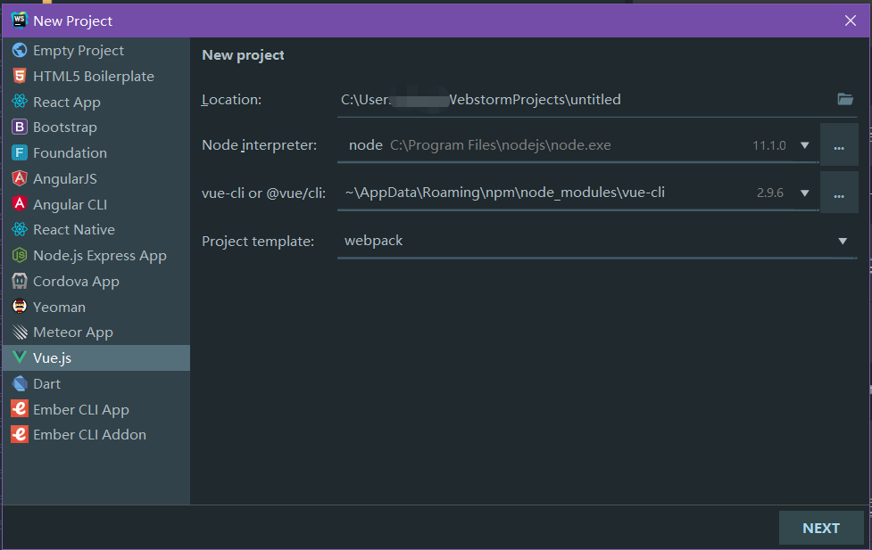

# acp-admin
###### v1.0.0 [版本更新日志](doc/version_history.md)
使用vue全家桶(Vue+Vue-router+Vuex+axios)、iview样式库构建的前端项目。该项目是前后端分离架构中的“前端部分”

## Project setup
```
npm install
```

### Compiles and hot-reloads for development
```
npm run serve
```

### Compiles and minifies for production
```
npm run build
```

### Run your tests
```
npm run test
```

### Lints and fixes files
```
npm run lint
```

### Run your unit tests
```
npm run test:unit
```

### Customize configuration
See [Configuration Reference](https://cli.vuejs.org/config/).

## 部署运行
该工程默认运行于 nodejs 中，也可根据实际需要运行在其他 web 容器

## 一、环境搭建
##### （一）安装 [node.js](http://nodejs.cn)，并验证
``` bash
node -v
```
##### （二）安装淘宝 npm 镜像，之后使用 cnpm 代替 npm
``` bash
npm install -g cnpm --registry=https://registry.npm.taobao.org
```
##### （三）安装 webpack
``` bash
cnpm install webpack -g
```
##### （四）安装全局 vue-cli 脚手架
``` bash
cnpm install -g @vue/cli
```
## 二、全新创建工程
##### （一）命令创建
``` bash
vue create acp-admin
```
##### （二）WebStorm 创建


## 三、安装所有依赖插件
``` bash
npm install
```
## 四、开发
##### （一）国际化
- 语言包路径：src/lang
- 在语言包路径下新增或修改语言属性
- 在 src/lang/index.js 中加载新的语言包
